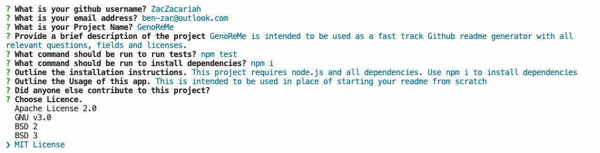

# GenoReMe

## Description

GenoReMe is intended to be used as a fast track Github readme generator with all relevant questions, fields and licenses.

Demo Video: https://youtu.be/Yz87J9qSiMI)

## Table of Contents 

- [Installation](#installation)
- [Usage](#usage)
- [Credits](#credits)
- [License](#license)

## Installation
This project requires node.js and all dependencies. Use npm i to install dependencies

How do I install Dependencies?
npm i

## Usage

This is intended to be used in place of starting your readme from scratch

## Credits

## License 

This project is licensed under the MIT License.

Find more about this license here: https://opensource.org/licenses/MIT.

        

## Tests

How do I run tests?
npm test

## Questions

Please direct your questions towards Ben at:
Github: ZacZacariah
Email: ben-zac@outlook.com

    